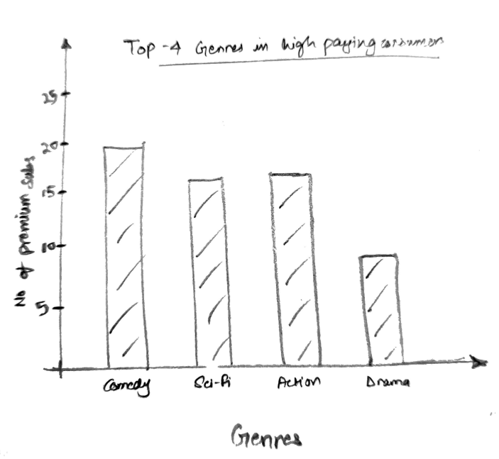
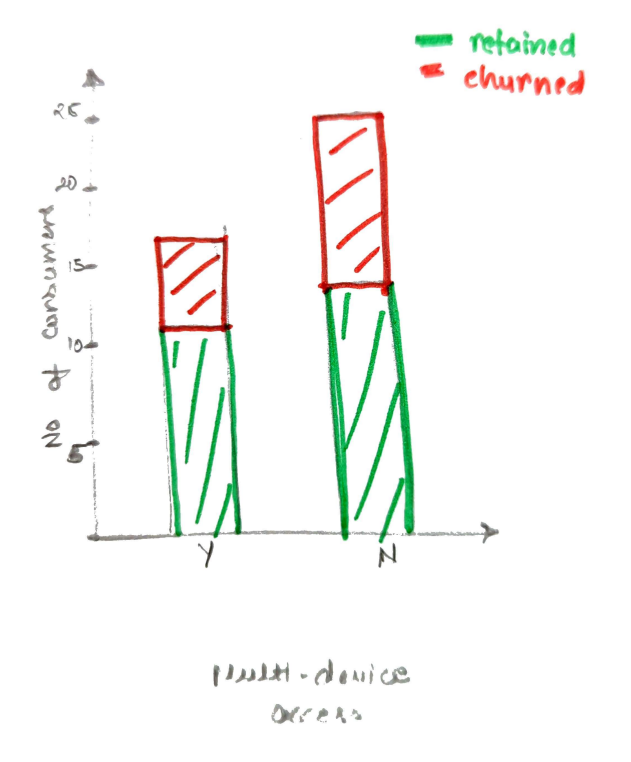
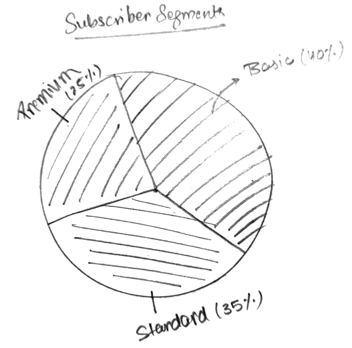

# Project Part 1

## Title: Profit Maximisation for Subscription Service
This project output is meant for an executives making decisions for the subscription company.

## Summary (What I expect to achieve):
My goal is to analyse the existing patterns in customer behaviour, in context for streaming platforms (like Netflix, Prime, etc).
I have used data from over 100000 records for this viualisations which can be found at: https://www.kaggle.com/datasets/safrin03/predictive-analytics-for-customer-churn-dataset under test data.

It has a lot of data points (and probably insights) like MonthlyCharges,	TotalCharges,	SubscriptionType, GenrePreference, etc to determine what high paying users are interesed in! I will include multiple visualisations in the the final project that are in a rough form right now. I got interested in this particular project, beause I have performed Cohort Analysis in the previous internship, and executive do really care about this data!

## Outline:
This is what I expect the data will look like, (eg: the lower subscriptions rate will have higher churn/attrition rate)

Setup: Talk about the market, how competititve it would be, optimising engagement and deciding where to put more money (marketing and production)
Issues and Obervations: My assumption is that subscribers with lower subscription price are prone to more attrition, high value customers prefer a particular genre, factors that lead to attrition like long ads, etc.
Identifying patterns: Patterns found in the current market data and where to spend marketing dollars (on a user segment) or production dollars (towards a particular genre)
Insights: Reveal top 5 genres for high value consumer, and other stuff where one should focus.
Call to action: Exactly point out where to put their investment!

## Initial Sketches

## Data Source:

My data source can be found at https://www.kaggle.com/datasets/safrin03/predictive-analytics-for-customer-churn-dataset.

This dataset is part of a data science project focused on customer churn prediction for a subscription-based service, I have used the randomly sliced test dataset by Kaggle user safrin03. Customer churn, the rate at which customers cancel their subscriptions, is a vital metric for businesses offering subscription services.

### Tentative Data Use Plan: 
The features I am really interested in are SubscriptionType, Churn, MonthlyCharges, ViewingHoursPerWeek, along with some other features like MultiDeviceAccess, PaymentMethod and GenrePreference, if needed.
Customer Segmentation: Segment customers based on content preferences, payment methods, and engagement to identify high-value groups for targeted retention strategies.
Feature Adoption Impact: Analyze the impact of features like MultiDeviceAccess and PaperlessBilling on churn and satisfaction.

## Method and Medium
I will be using Sharthand to walk through my findings, where I also plan to incorporate Tableau visualisations!
Medium: The final output will be a digital, interactive story with clear data-based insights.

