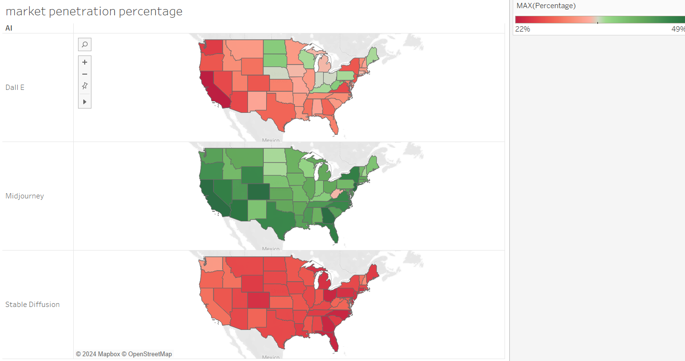

<h1>Comparing market shares and penetration percentage</h1>

For this visualisation, I have chosen the dataset containing Generative AI Search Trends in the United States!
The data is from Google trends, and you can find the subset I used [here](https://data.world/makeovermonday/generative-ai-search-trends-in-the-united-states)
 
The original visualisation looks like this:
 
 
<h2>The reason</h2>
I have chosen this particular visualization because these AI technologies are highly relavant at the forefront of discussions in tech and data science community! By visualizing how different regions in the U.S. engage with these technologies, the visualization not only presents a snapshot of current trends but also offers insights into regional technological adoption and preferences.
Other than this, when I came across this data, I felt that this data definitely tells some stories, and there were multiple dimensions to explore. For example, for my visualisation, I have made it according to what a person working as a executive in these companies would like to look at for further expansion, or to decide where to put down some marketing dollars. Other than that, we could also do a time-analysis by implementing raunning bar graphs which would answer: "How relevant is this particular AI in current time?".
  
<h2>My Process: </h2>
 
So I didn't find much for a person in the company management looking at the chart, so I started to redesign the same!
So my initial choice was a stacked bar graph which I believed would right away depict how each technology stood against the others within each state. However, upon critique, I realized that while this method shows comparative market share effectively, it fails to provide a clear, immediate understanding of each technology's individual market presence. Like, I was unable to figure out what market share was occupied was the middle(yellow depicting midjourney) part.
 
To find a better solution, I experimented a bit with a dot plot. This option seemed promising because it aimed to simplify things by plotting individual points for each technology per state. However, it came with its own problems. The dots overlapped in some areas, the names of states overlapped as well, and the plot became cluttered and hard to read. Instead of making the data clearer, it made it more confusing.

 
Then I plotted all the bar graphs next to each other, this seemed the cleanest and I went ahead with user review, the colors were discrete and people liked it. The only issue was, it needed a lot of scrolling. 
This is how it looked at this point of time:

<noscript></noscript><object class='tableauViz'  style='display:none;'><param name='host_url' value='https%3A%2F%2Fpublic.tableau.com%2F' /> <param name='embed_code_version' value='3' /> <param name='site_root' value='' /><param name='name' value='ai_data_npivot&#47;State-wisemarketshare' /><param name='tabs' value='no' /><param name='toolbar' value='yes' /><param name='static_image' value='https:&#47;&#47;public.tableau.com&#47;static&#47;images&#47;ai&#47;ai_data_npivot&#47;State-wisemarketshare&#47;1.png' /> <param name='animate_transition' value='yes' /><param name='display_static_image' value='yes' /><param name='display_spinner' value='yes' /><param name='display_overlay' value='yes' /><param name='display_count' value='yes' /><param name='language' value='en-US' /><param name='filter' value='publish=yes' /></object>

 
Also, people said that they can't associate this with US states. So, the obvious next point was to get to MAPS!
I could not put all the data together on a map, so I referred to [WatchMeViz](https://www.youtube.com/live/-w0ynF43yZg) to get an initial thought. I learnt how to build a Pivot table here and implemented the same in the next visualisation!
I went ahead with the initial pies and donut graphs on the maps, this captures good information but it was still not pleasing on the eyes.
After this I applied cloropleth and put all the maps in rows and applied a color grading for good understanding. The one thing I could not implement with the current skills was to add the names and percentages of other AI engines in the tooltip!

At this point the visualisation looked like this:

 
<h2>Feedback I recieved:</h2>
 
D: "The overall visualisation looks fine, captures data, but still the three things on a single canvas looked wierd". They complimented the use of color grading and appriciated the capturing of information.  
S: "The viz looks interesting, but as a decision maker I would like to focus on one at a time. The color looks good, and map provides context. Maybe change the red to lesser market share and green to more.". They basically asked me to reverse the color grading.
 
I agreed with the feedback and impleemnted the changes. Here's the final visualisation:

<noscript></noscript><object class='tableauViz'  style='display:none;'><param name='host_url' value='https%3A%2F%2Fpublic.tableau.com%2F' /> <param name='embed_code_version' value='3' /> <param name='path' value='shared&#47;FXNZH658P' /> <param name='toolbar' value='yes' /><param name='static_image' value='https:&#47;&#47;public.tableau.com&#47;static&#47;images&#47;FX&#47;FXNZH658P&#47;1.png' /> <param name='animate_transition' value='yes' /><param name='display_static_image' value='yes' /><param name='display_spinner' value='yes' /><param name='display_overlay' value='yes' /><param name='display_count' value='yes' /><param name='language' value='en-US' /><param name='filter' value='publish=yes' /></object>

